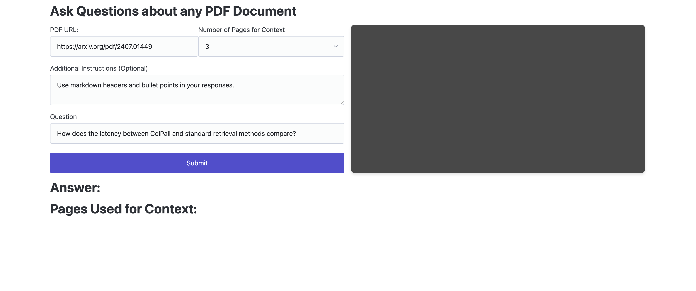
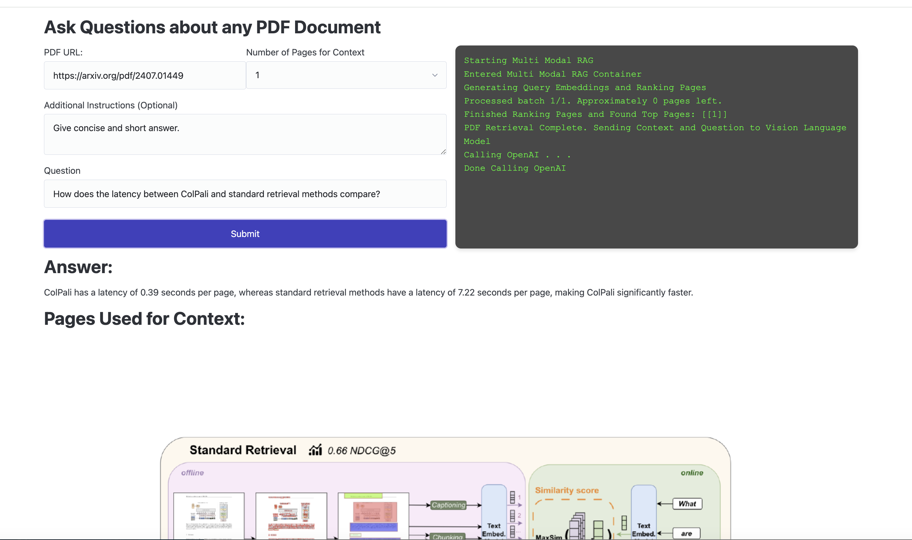

# Multimodal Retrieval with ColPali, Modal, and FastHTML


This was a project to force myself to build my first FastHTML app.
It used Modal for the backend and FastHTML for the frontend.





The main code is the following:

- [multi_modal_rag.py](https://github.com/DrChrisLevy/DrChrisLevy.github.io/blob/main/posts/colpali/multi_modal_rag.py) - A Modal app running on CPU that runs the multimodal retrieval logic.
- [pdf_retriever.py](https://github.com/DrChrisLevy/DrChrisLevy.github.io/blob/main/posts/colpali/pdf_retriever.py) - A Modal app running on GPU processes and caches images/embeddings for each PDF and runs inference for ColPali.
- [utils.py](https://github.com/DrChrisLevy/DrChrisLevy.github.io/blob/main/posts/colpali/utils.py) - some simple utility functions for logging and generating unique folder names in the Modal Volumes.
- [main.py](https://github.com/DrChrisLevy/DrChrisLevy.github.io/blob/main/posts/colpali/main.py) - the FastHTML app that runs the frontend.
- [colpali_blog.ipynb](https://github.com/DrChrisLevy/DrChrisLevy.github.io/blob/main/posts/colpali/colpali_blog.ipynb) - a notebook that I used to generate the blog post for this project.

There is some throw away code in the folder `demos/`. I was experimenting there with steaming markdown in FastHML
as well as deploying `"Qwen/Qwen2-VL-7B-Instruct"` for the vision language model. You can ignore this code. It's just for my own notes.

# Setup

- you need an account with Modal, OpenAI and Hugging Face.
- create a `.env` file with the following variables:

```
HUGGING_FACE_ACCESS_TOKEN=YOUR_TOKEN
GITHUB_ACCESS_TOKEN=YOUR_TOKEN
OPENAI_API_KEY=sk-YOUR_KEY
```

- Create a virtual environment and install the dependencies:

```
python3 -m venv env
source env/bin/activate
pip install -r requirements.txt
```

- Deploy the backend Modal apps:

```
modal deploy multi_modal_rag.py
modal deploy pdf_retriever.py
```

# Testing Modal Backend

This will run the backend tests directly on Modal.
If these pass it means you have successfully deployed the backend Modal apps.

```
pytest -n 10 tests
```

# Running the FastHTML App

```
python main.py
```

# Lint

```
ruff check . --select F,I --fix; ruff format .